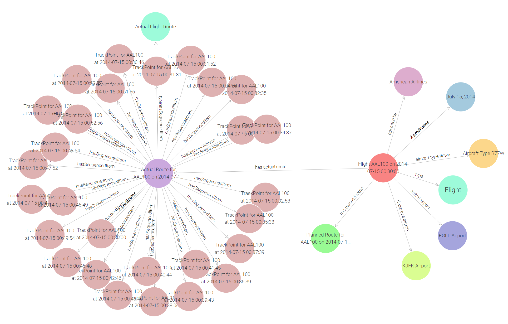
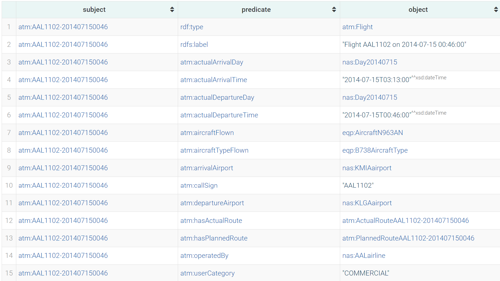
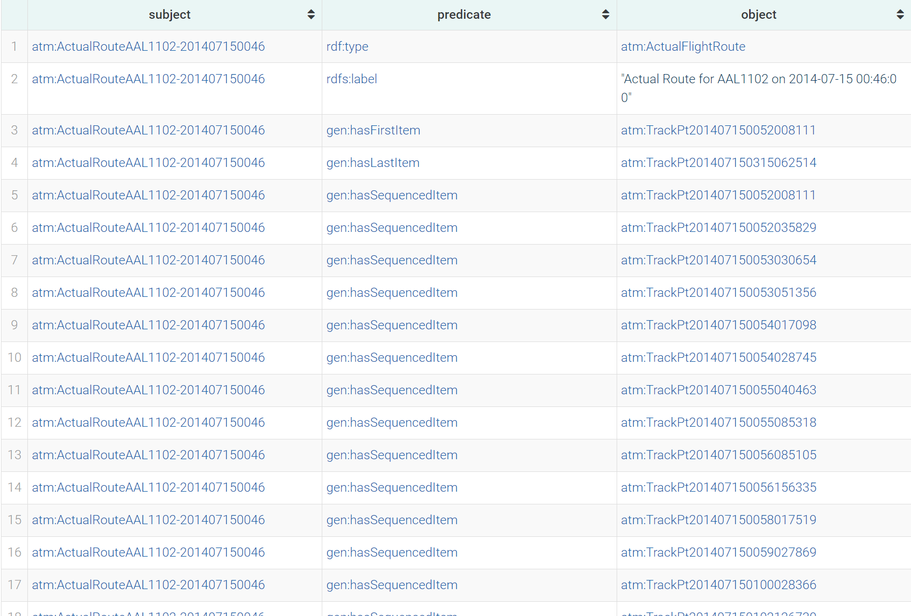
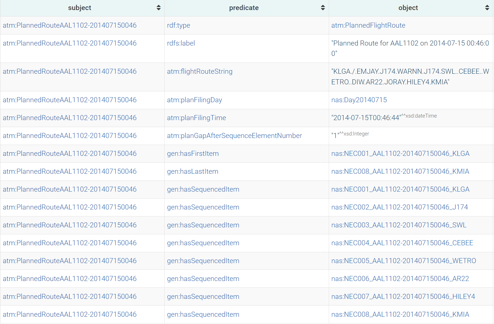

# ATMOnto Stuff
This folder contains all useful queries from the entirety of the ATMOnto ontology suite uploaded to GraphDB.

## Files in Here
* all_flights - query and file that holds all the flights and their attributes

Technically no other queries are needed... go to [this section](#atmonto-structure) to see what is needed.

## How to get ATMOnto into GraphDB?
1. Go here: https://data.nasa.gov/ontologies/atmonto/ATM
2. Click the [link](https://data.nasa.gov/ontologies/atmonto/allFilesTTL.zip) to download everything as a zip file in Turtle format
3. Open GraphDB
4. Make a new repository
5. Import tab, drag all of the .ttl files in
6. (Optional) Make a named graph for instances and one for schema files (ATMOnto denotes instance files with xxxInst.ttl)
7. Once done, you can begin to explore; this is what these queries do, but you don't need to run them necessarily, they just pull out the interesting parts

To start exploring Flights, Waypoints and such in GraphDB directly, run the following query and then pick through the graph in the query results tab:
```
PREFIX atm: <https://data.nasa.gov/ontologies/atmonto/ATM#>
select * where { 
	?s ?p ?o ;
    	a atm:Flight .
} 
```

## ATMOnto Structure


The structure ATMOnto uses is like this:

* Each flight is an atm:Flight
* Every atm:Flight has attributes like dates, the aircraft used, the airports, planned routes and actual routes
* Every atm:ActualRoute has dozens upon dozens of "trackpoints" (the same as waypoints)

See the next three images to understand the namespaces and terms to use for Flights, Actual Routes and Planned Routes (respectively):

## Flights


## Actual Routes
The number of sequenced items is often in the hundreds for each flight...


## Planned Routes

